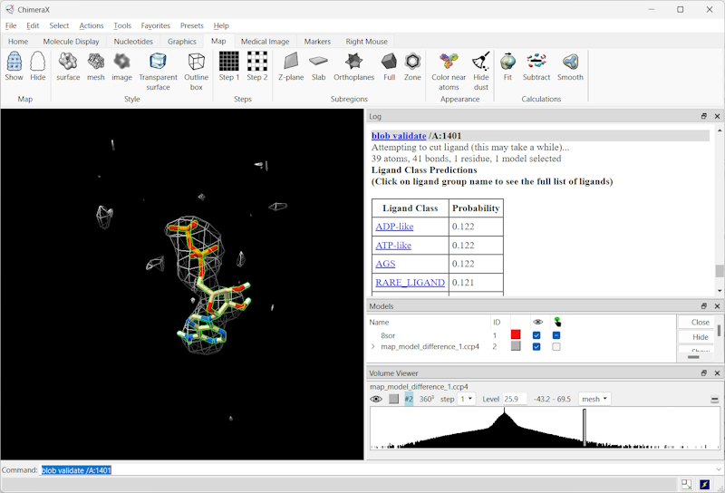

[](https://doi.org/10.1093/bioinformatics/btae749)
[](https://ligands.cs.put.poznan.pl)

# ChimeraX LigandRecognizer Bundle

This bundle provides ChimeraX commands for recognizing ligands in cryoEM and X-ray crystallography maps using deep learning. The bundle is accompanying software to the paper "Ligand Identification in CryoEM and X-ray Maps Using Deep Learning" by Karolczak *et al.* To get more information on the reseach behind this tool you can:
- read about the used model on [Bioinformatics](https://doi.org/10.1093/bioinformatics/btae749);
- try the [Streamlit demo](https://ligands.cs.put.poznan.pl) to see the model in action;
- find the pretrained model and experiment code at [this GitHub repository](https://github.com/jkarolczak/ligand-classification); 
- get the datasets used for training and testing the model at [Zenodo](https://zenodo.org/records/10908325). 

## Installation

### ChimeraX Toolshed

To install the ligand recognition tool, run ChimeraX and click *Tools* -> *More Tools...* menu item. In the popup, search for "LigandRecognizer" and click the *Install* button. The tool's commands should now be available in ChimeraX. If this procedure fails, please refer to the manual installation instructions below.

### Manual Installation

You can install the bundle manually by downloading this repository (green *Code <>* button, then *Download ZIP* on top of this page) and running the following commands in the repository directory.

**Linux:**
```bash
chimerax --nogui --cmd 'devel build . exit true'
chimerax --nogui --cmd 'devel install . exit true'
```

**Windows:**
```cmd
ChimeraX-console.exe --nogui --cmd "devel build . exit true" 
ChimeraX-console.exe --nogui --cmd "devel install . exit true" 
```

After running the above commands, the `blob validate` and `blob recognize` commands should be available in ChimeraX. You can check it by running 

```shell
help blob
```
in the ChimeraX command line.

## Usage
This tool assumes, that both a .pdb/.cif (partial) model and a .ccp4 difference map are loaded into ChimeraX (e.g. `open 8SOR/8sor.cif; open 8SOR/map_model_difference_1.ccp4;`).  A key requirement is that the tool works on a difference (omit) map rather than a regular (model) map. The difference map should be the result of PHENIX's command `phenix.real_space_diff_map "$MODEL" "$MAP" "resolution=$RES"` for cryoEM or the Fo-Fc map for X-ray crystallography. To obtain the cryoEM difference map, you can use the `computeMapModelDifference.sh` script available in this repository. With the partial model and difference map opened, within ChimeraX you can run the commands presented below to validate an existing ligand or to predict a ligand matching a selected map fragment.

The tool implements three basic commands:
1. `blob autothreshold [map_id] [style] [density_std_threshold]`: set a surface-defining nthreshold for the map / volume and choose display options..
2. `blob recognize [map_id] [surface_id] [pdb_id] [flg_xray] [density_threshold]`: tries to identify a ligand from a selected map fragment (surface).
3. `blob validate res_id [map_id] [pdb_id] [flg_xray] [density_threshold]`: validates a previously modeled ligand at residue res_id.
All the parameters in brackets are optional and if they are not provided the command will use the currently active map, structure, surface, and assume that the map is a cryoEM map (xray False). The above three commands are aliases for `blobus validatus`, `blobus recognitus`, and `blobus autothresholdus` respectively.
    
Examples:
- `blob autothreshold style 1` (sets an automatic threshold on the displayed map (volume) and changes the display style of the map and model)
- `blob validate /A:1401` (validates a ligand at residue 1401 in chain A using the default map and structure);
- `blob recognize #2 #4.1` (recognize a ligand using map #2 and a user-selected surface (cropped map fragment) #4.1);
- `blob validate /A:1401 flg_xray 1` (validates a ligand at residue 1401 in chain A using the default map and structure and treat the map as an X-ray difference map).

To select a map fragment for recognition, follow these steps:
1. Open the map and model files in ChimeraX;
2. Adjust the map levels as desired (you can use the `blob autothreshold` command);
3. Toggle the outline box for the map (From the top menu: Map / Style / Toggle Outline Box);
4. Crop the volume (From the top menu: RightMouse / Crop Volume);</li>
5. Drag the box edges to the desired position with the right mouse button;</li>
6. Optionally use the menu option Right Mouse / Erase tool to zero out unwanted densities</li>
7. Optionally use the menu option  Right Mouse / Blob tool to select a contiguous map fragment of interest.</li>
8. Use the `blob recognize` command with the selected map fragment.

The tool will output the top 10 predicted ligand names and their confidence scores in ChimeraX log window. The confidence score is a value between 0 and 1, where 1 means that the model is certain of a given ligand type. The ligands are grouped and named by their PDB ligand identifiers, e.g. "ATP" or "ADP". Ypu can click on the ligand group name to see the names of the ligands in the group.



You can also take a look at the step-by-step guide on how to use the tool in the [Tutorial](tutorial.pdf).

## Citation
```bibtex
@article{10.1093/bioinformatics/btae749,
    author = {Karolczak, Jacek and Przybyłowska, Anna and Szewczyk, Konrad and Taisner, Witold and Heumann, John M and Stowell, Michael H B and Nowicki, Michał and Brzezinski, Dariusz},
    title = {Ligand Identification in CryoEM and X-ray Maps Using Deep Learning},
    journal = {Bioinformatics},
    pages = {btae749},
    year = {2024},
    month = {12},
    abstract = {Accurately identifying ligands plays a crucial role in the process of structure-guided drug design. Based on density maps from X-ray diffraction or cryogenic-sample electron microscopy (cryoEM), scientists verify whether small-molecule ligands bind to active sites of interest. However, the interpretation of density maps is challenging, and cognitive bias can sometimes mislead investigators into modeling fictitious compounds. Ligand identification can be aided by automatic methods, but existing approaches are available only for X-ray diffraction and are based on iterative fitting or feature-engineered machine learning rather than end-to-end deep learning.Here, we propose to identify ligands using a deep learning approach that treats density maps as 3D point clouds. We show that the proposed model is on par with existing machine learning methods for X-ray crystallography while also being applicable to cryoEM density maps. Our study demonstrates that electron density map fragments can aid the training of models that can later be applied to cryoEM structures but also highlights challenges associated with the standardization of electron microscopy maps and the quality assessment of cryoEM ligands.Code and model weights are available on GitHub at https://github.com/jkarolczak/ligands-classification  . Datasets used for training and testing are hosted at Zenodo: 10.5281/zenodo.10908325. An accompanying ChimeraX bundle is available at https://github.com/wtaisner/chimerax-ligand-recognizer.Supplementary data are available at Bioinformatics online.\\},
    issn = {1367-4811},
    doi = {10.1093/bioinformatics/btae749},
    url = {https://doi.org/10.1093/bioinformatics/btae749},
    eprint = {https://academic.oup.com/bioinformatics/advance-article-pdf/doi/10.1093/bioinformatics/btae749/61238985/btae749.pdf},
}
```
